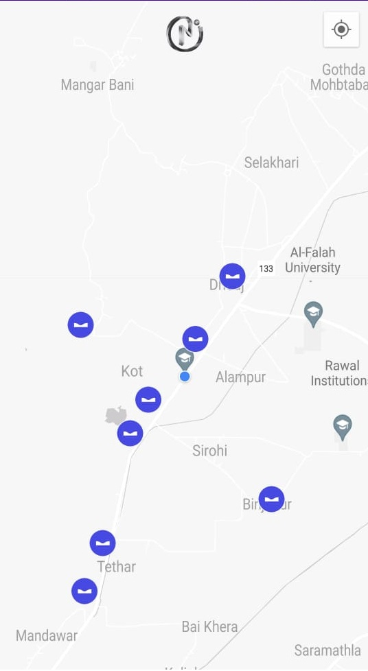

Points API Integration
---------------

Demonstrating how to use Points API for Android [API Collection](https://documenter.getpostman.com/view/11731303/2s8YKGj1vx).



Pre-requisites
--------------

* The demo apps require that you add your own Points API key. If not provided follow [Get an API Key](https://auth.novaeavenue.com/signin) for creation.


### Steps
1. Dependency in **project level gradle** (build.gradle) **[OPTIONAL]**

    Add the following code to the `dependencies` element under `buildscript`
    
    
    ```groovy
    plugins {
        // ...
        id 'com.google.android.libraries.mapsplatform.secrets-gradle-plugin' version '2.0.1' apply false
    }
    ```
    
2. Dependency in **app level gradle** (app/build.gradle) **[OPTIONAL]**

    a. Add this plugin in `plugins` closure
    
    ```groovy
    id 'com.google.android.libraries.mapsplatform.secrets-gradle-plugin'
    ```
    
    b. Add this dependencies to `dependencies` closure
    
    ```groovy
        implementation 'com.google.android.gms:play-services-location:21.0.0'
        implementation 'com.google.android.gms:play-services-maps:18.1.0'
    
        // Network
        implementation "com.squareup.okhttp3:okhttp:4.9.1"
    
        // Json Parsing
        implementation "com.fasterxml.jackson.core:jackson-databind:2.13.3"
    ```

Getting Started
---------------

Add Points API key in local.properties [OPTIONAL]
1. Setup **GET** request URL (HTTP)
    
    ```kotlin
    val POINTS_BASE_URL = "https://apis.novaeavenue.com/points/api/v1/nearby"
    ```
    
2. Add required parameters
    1. `key`
    2. `latLng`
    
    Here `key` will be fetched from `apiToken` previously added in `local.properties` or from provided doc
    
    ### `latLng` will be sent from vehicle current latitude and longitude separated with comma 
    
    Final form of request →
    
    E.g.:
    
    ```json
    "https://apis.novaeavenue.com/points/api/v1/nearby?key=YOUR_API_KEY&latLng=28.3267424,77.1866192"
    ```
    
3. Call API
    
    ```kotlin
    val request = Request.Builder().apply {
    	url("$POINTS_BASE_URL?key=$YOUR_API_KEY&latLng=28.3267424,77.1866192")
    	get()
    	build()
    }
    val response = mOkHttpClient.newCall(request).execute()
    ```


Error Codes
---------------
  - Codes in the **`2xx` r**ange indicate success
  - Codes in the **`4xx`** range indicate an request error
  - Codes in the **`5xx`** range indicate an internal server error

  | Code | Short Description | Long Description |
  | --- | --- | --- |
  | 200 | Success | Request sent successfully |
  | 400 | Bad Request | Usually missing parameters |
  | 401 | Unauthorized | No valid API key provided |
  | 403 | Forbidden | The API key doesn't have permissions to perform the request |
  | 404 | Not Found | Requested URL not found  |
  | 409 | Multiple usage | Same API key used for multiple clients |
  | 410 | API Key Exhausted | Quota Exceeded  |
  | 500+ | Internal Server Error | Something went wrong in Novae Avenue Servers |


Support
-------

- Stack Overflow: https://stackoverflow.com/questions/tagged/api+okhttp+get

If you've found an error in these samples, please file an issue:
https://github.com/Papli-Labs/points_android_app

Patches are encouraged.
